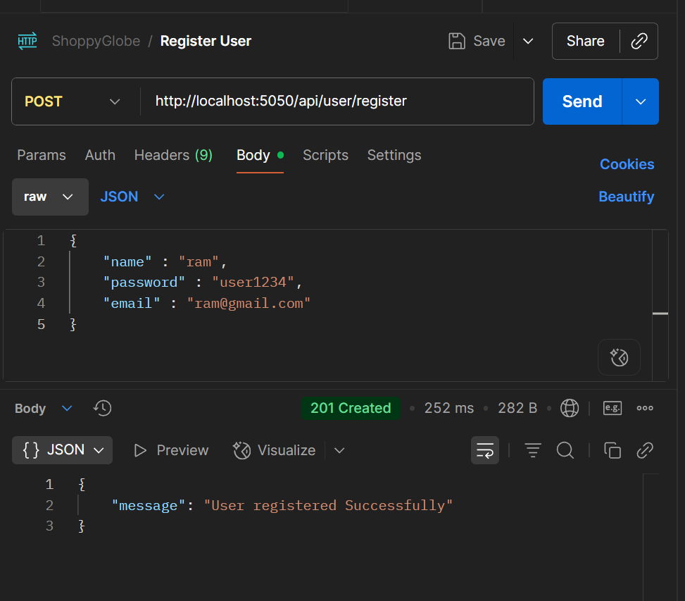
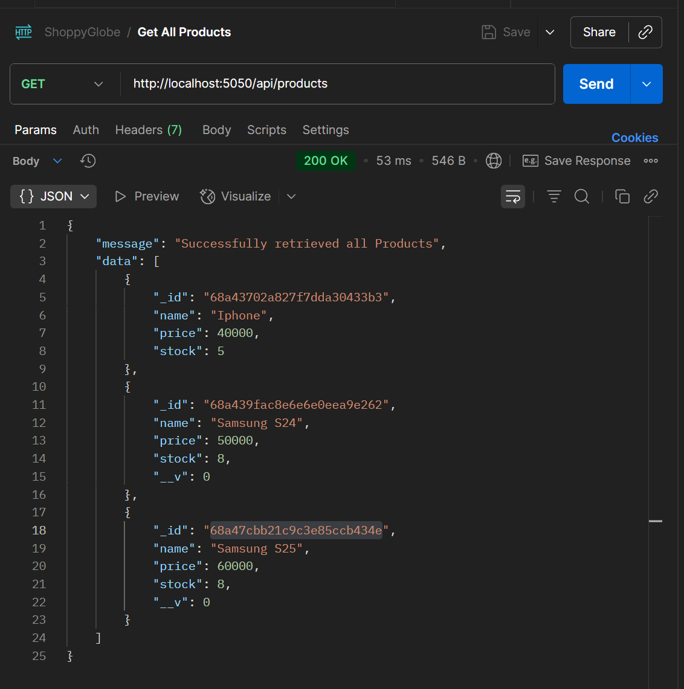
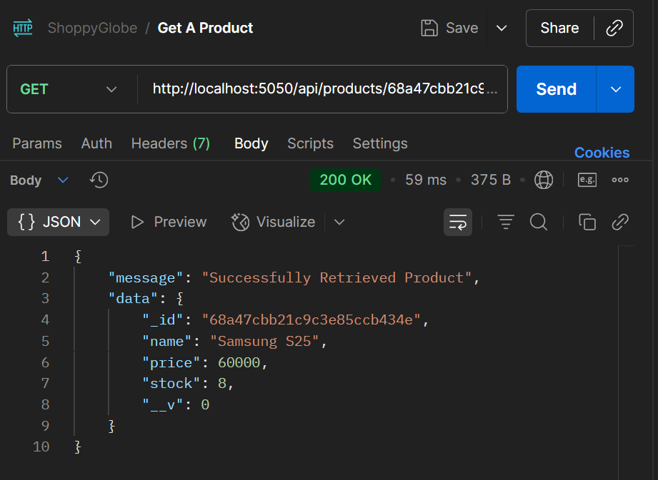
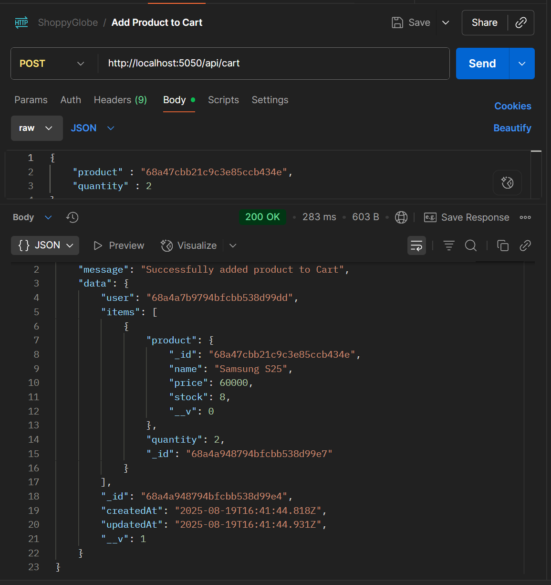
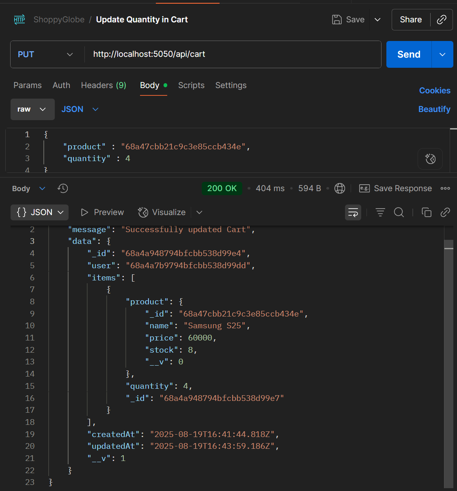
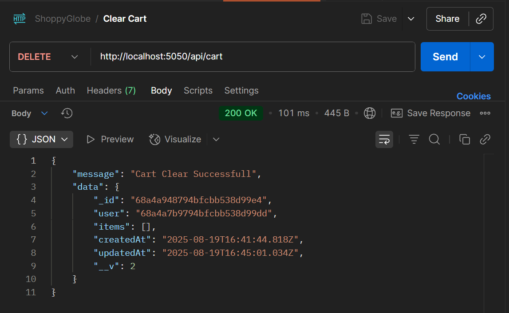
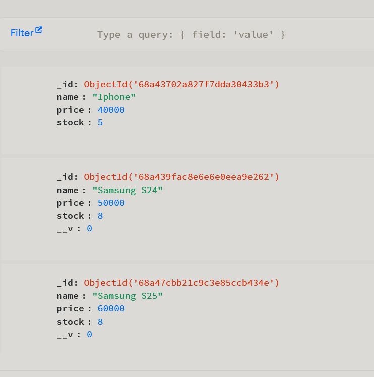
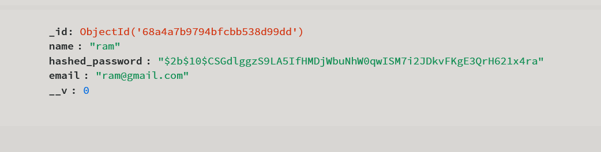
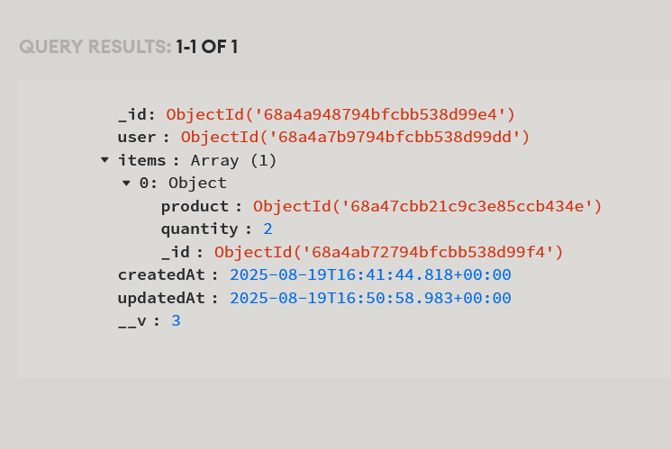

# 🛍️ ShoppyGlobe - E-commerce Backend (Node.js + Express + MongoDB)

## 📌 Project Overview

This project is the backend for **ShoppyGlobe**, an e-commerce application.
It provides RESTful APIs for products, cart management, and user authentication.
The backend is built using **Node.js, Express.js, MongoDB, and JWT Authentication**.

---

## 🚀 Features

* **Product Management**

  * Fetch all products
  * Fetch product details by ID
* **Shopping Cart**

  * Add items to cart
  * Update cart item quantity
  * Remove items from cart
* **Authentication**

  * User registration with hashed password
  * Secure login with JWT token
  * Protected routes
* **Error Handling & Validation**

  * Validation for product/cart operations
  * Global error handling

---

## 🛠️ Tech Stack

* **Backend:** Node.js, Express.js
* **Database:** MongoDB (Mongoose ODM)
* **Authentication:** JWT + bcrypt.js
* **Testing:** POSTMAN

---

## ⚙️ Setup Instructions

1. Clone repository:

   ```bash
   git clone https://github.com/ananthakrishn04/ShoppyGlobe_backend_nodeJs.git
   cd ShoppyGlobe_backend_nodeJs
   ```
2. Install dependencies:

   ```bash
   npm install
   ```
3. Create `.env` file with:

   ```
   PORT=5050
   MONGO_URI="mongodb://localhost:27017/shoppyglobe" //or use atlas
   SECRET_KEY=your_jwt_secret
   ```
4. Run server:

   ```bash
   npm start
   ```

   Server runs at: [http://localhost:5050](http://localhost:5050)

---

## 📂 Project Structure

```
shoppyglobe-backend/
│── models/          # Mongoose schemas
│── routes/          # Express routes
│── controllers/     # Business logic
│── middleware/      # Auth middleware
│── app.js           # Main entry point
│── package.json
│── .env
│── README.md
```

---

## 📡 API Endpoints

### 🔑 Authentication

* `POST /register` → Register new user
* `POST /login` → Authenticate user & return token

### 🛍️ Products

* `GET /products` → Get all products
* `GET /products/:id` → Get product by ID
* `POST /products/` → Add product

### 🛒 Cart (Protected Routes)

* `POST /cart` → Add product to cart
* `PUT /cart/` → Update cart item quantity
* `DELETE /cart/` → Remove product from cart

---

## 🔐 Authentication Flow

1. Register with username & password (password stored hashed).
2. Login with credentials → receive JWT token.
3. Send token in headers:

   ```
   Authorization: JWT <token>
   ```

   to access **cart APIs**.

---

## 🧪 API Testing with POSTMAN

All routes were tested with **POSTMAN**.
Screenshots:

### Authentication

* 
* 

### Products

* 
* 

### Cart

* 
* 
* 

---

## 📸 MongoDB Screenshots

* Products collection
* Cart collection





---